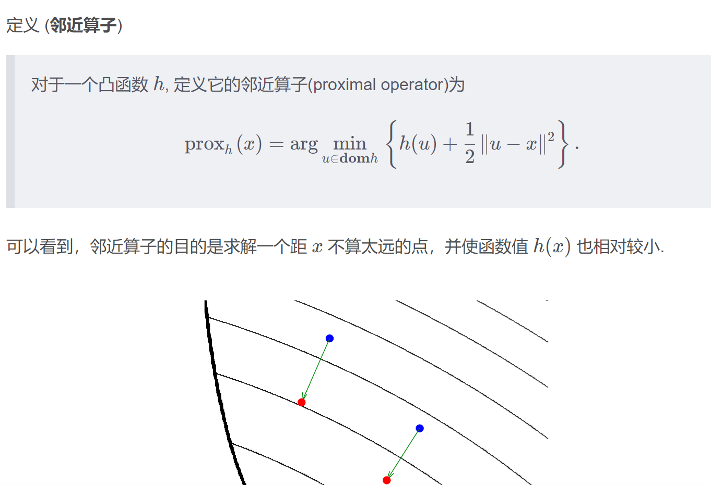
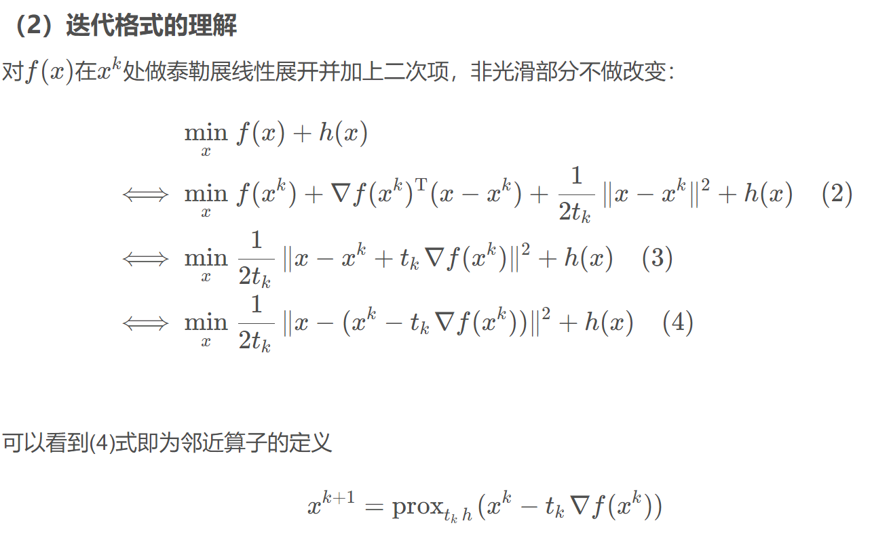
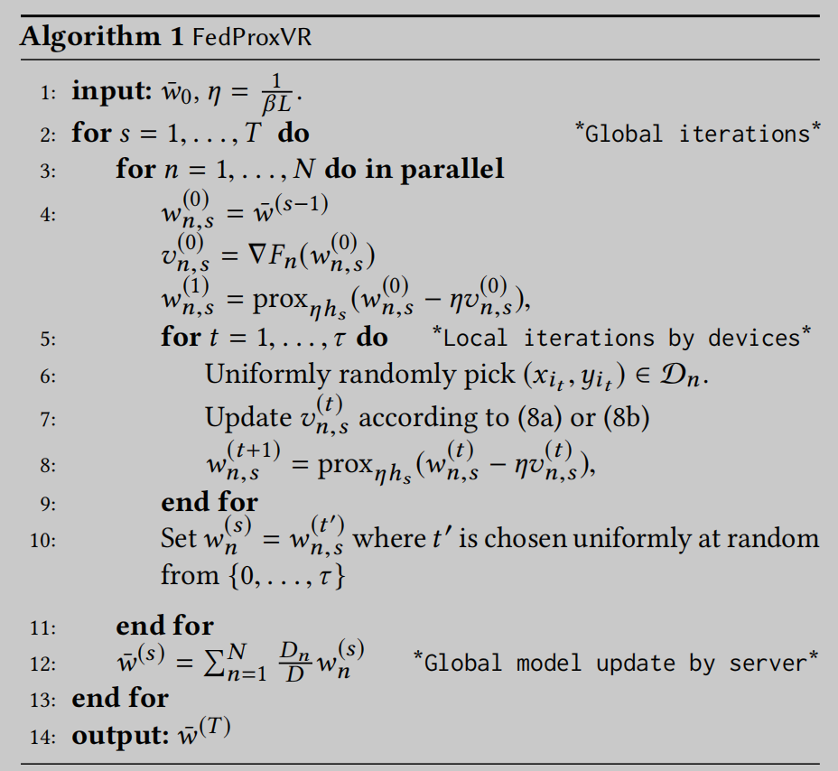

# 3 邻近梯度算法笔记

基于近端随机方差简化梯度算法的联合学习

**Federated Learning with Proximal Stochastic Variance Reduced Gradient Algorithms**

对于无约束凸优化问题，当目标函数可微时，可以采用梯度下降法求解；

当目标函数不可微时，可以采用次梯度下降法求解；

当目标函数中同时包含可微项与不可微项时，常采用邻近梯度下降法求解。

上述三种梯度算法均属于离线批处理类型算法

在线算法：在线算法在处理开始时，不需要知道输入的所有数据，只有到输入最后完成，才能得到最后所需的结果，处理过程中输出的结果都是为最后结果的输出而服务，如插入排序算法，构建后缀树的Ukkonen 算法等；
离线算法：离线算法在处理开始时，就要知道输入的所有数据，而且处理过程中输出的结果，都是最终结果的一部分，如选择排序算法。

==参考==https://blog.csdn.net/v20000727/article/details/135490883#Proximal_Gradient_Method_0

==算法实现参考==https://blog.csdn.net/m0_60947585/article/details/135313988

# 摘要和相关工作

==摘要：==

联邦学习（FL）是一种快速发展的分布式机器学习技术，涉及到大量用户设备的参与。

虽然FL具有数据隐私和用户生成数据的丰富，但它在用户数据和设备之间的==异构性挑战==使==算法设计和收敛分析==复杂化。

为了解决这些挑战，我们提出了一种算法，利用近端随机方差减少梯度方法的非凸FL

该算法由两个嵌套循环组成，允许用户设备在将这些本地模型发送到服务器进行全局模型更新（外循环）**之前，将其本地模型近似更新到一个精度阈值（内循环）。**

我们描述了局部和全局模型更新的收敛条件，并通过算法的参数控制从这些条件中提取各种见解。我们还提出了如何优化这些参数，使FL的**训练时间最小化**。

实验结果不仅验证了该算法的理论收敛性，而且表明该算法在收敛速度方面优于现有的基于随机梯度下降的方法。

==关键词：== Distributed Machine Learning, Federated Learning, Stochastic Gradient Descent

一个保留隐私的学习技术的一个例子是最近提出的联邦学习（FL）范式[20]。这种学习技术允许用户设备通过只将本地模型而不是向中央服务器发送大量原始数据来协作构建全局训练模型，从而不仅保护了设备上数据的数据隐私，还节省了通信带宽。由于本地数据源是自然分布的，FL也**带来了设计学习算法的新挑战**，考虑到统计异质性，其中设备的数据可能是非同分布的。

==国内外现状：==

机器学习中的实际优化算法，如梯度下降（GD）、随机梯度下降（SGD）和方差减少SGD（如SVRG [11]），已被广泛用于在FL [12,20,31]中实现设备的局部更新。FL [20]的先驱工作之一提出了使用平均SGD局部更新的FedAvg，经验表明该方法在非凸联邦设置中表现良好。[12]的作者提出FSVRG通过经验提高FedAvg的性能SVRG。然而，这两项工作还缺乏理论上的收敛性分析。[30]的作者使用SGD提供了他们提出的类似于FedAvg的方案的收敛性分析，但对所有设备的数据都采用了宽松的i.i.d假设。虽然[31]中提出的算法使用了具有可证明收敛性的GD，但它们的分析仅限于凸损失函数，这可能不适用于最近显著成功的深度学习应用，这些应用通常是非凸[14]。此外，当训练样本数量较大时，GD（适用于所有数据样本）比SGD或方差减少SGD（两者都适用于随机采样的数据子集）更耗时和计算密集得多。考虑到典型的电池容量和计算能力有限的智能设备，对于FL而言，使用SGD及其变体的快速训练将是比GD更可行的选择。另一方面，通过近似求解用户局部问题，提出了一种保证收敛性的FedProx框架

虽然方差减少SGD方法，如SVRG [11]和SARAH [22]已经被证明比SGD具有更快的收敛速度，但它是以一段时间迭代后的全批梯度计算为代价的。值得注意的是，周期性的全批处理评估策略完全符合FL固有的全局聚合性质（在每个设备上进行多次本地更新之后）。因此，观察到文献中缺乏一个完整的使用具有可证明收敛性的方差减少SGD的非凸FL设计，我们通过以下贡献来弥补这一差距

我们提出了一种proximal-stochastic-variance-reduced-gradientbased算法，名为FedProxVR，它由两个全局和局部迭代的嵌套循环组成。当服务器在每次全局迭代中执行全局模型更新时，设备使用近端SVRG或SARAH更新局部训练模型，达到一个精度阈值，这将影响局部迭代的次数。

首先给出了局部模型收敛到一个精度阈值的一个充分条件。这种条件反映了学习步长、局部迭代次数和精度阈值之间的关系。具体地说，我们定性地表明，通过控制参数化学习步长，当局部迭代次数限制在步长参数和局部精度阈值决定的范围内时，保证了局部模型更新的收敛性。

接下来，我们提供了全局模型更新的充分条件，它还捕获了设备和服务器之间的通信复杂性。我们证明了全局收敛性是由两个重要的控制旋钮决定的：局部精度阈值和一个近端惩罚参数。这两个参数也表征了局部模型收敛和全局模型收敛之间的权衡，为算法设计提供了线索

然后，我们提出了一种基于相应的控制变量的最小化总训练时间（分别在用户设备和服务器上的局部和全局模型更新延迟）的方法。我们还证明了这个最小化问题的数值解与FedProxVR的收敛性分析的理论结果相一致。

最后，我们验证了理论结果，使用各种真实和合成数据集与张量流。实验结果表明，与基于sgd的方法相比，FedProxVR可以提高FL的收敛速度

在非fl设置中，在构建比SGD更复杂、更准确的梯度估计器时，已经提出了各种方法，如SVRG [11]和SARAH [22]来减少SGD中梯度估计器的方差。基于这些众所周知的方差约简技术，人们提出了近端方法，如ProxSVRG [9,17]和ProxSARAH [23]来处理非凸、非光滑问题。

==目录：==

接下来，我们将分别在第2节和第3节中介绍相关的工作和系统模型。FedProxVR的设计和分析将在第4节中显示。最后，我们将在第5节中报告实验结果。所有的技术证明都将在附录中提供

# 系统模型

我们考虑一个由一个聚合服务器和一组N个设备组成的系统。每个设备n存储一个本地数据集Dn，其大小用Dn表示。

然后，我们可以用D = I n N =1 Dn来定义总数据大小。

在监督学习设置的一个例子中，在设备n，Dn定义了数据样本的集合为一组输入输出对{xi ，yi } Dn i=1，其中∈∈Rd是具有d特征的输入样本向量，而∈∈R是样本xi的标记输出值。这些数据可以通过使用设备来生成，例如，通过与移动应用程序的交互。

在一个典型的学习问题中，对于输入xi的样本数据{xi，yi}（例如，设备内各种应用程序的响应时间），任务是找到模型参数w∈R l ，l≥d，用损失函数fi（≥）描述输出yi。损失函数的一些例子有fi (w) = 1 2（x i Tw−yi）2 ，yi∈R用于线性回归，fi (w) = {0,1−yixiTw}，支持向量机，1}{−。器件n的损失函数定义为

然后，该学习模型是以下全局损失函数最小化问题的最小化器

# 算法设计与分析

在本节中，我们提出了该算法，并提供了其收敛性分析，并优化了算法参数。

## 1算法设计

在本节中，我们提出了该算法，并提供了其收敛性分析，并优化了算法参数。

## 2收敛性分析

## 3 超参数优化

# 实验

在本节中，我们将通过真实世界的实验来检验FedProxVR与基于sgd的FedAvg [20]相比的有效性。我们还展示了FedProxVR的经验收敛性如何通过改变其控制超参数与其理论结果相关联。所有的代码和数据都已准备好在GitHub [7]上发布

实验设置：为了评估FedProxVR在各种任务和学习模型上的性能，我们将在实验中使用不同类型的数据集。除了像[16,26]中那样捕获统计异质性的“合成”数据集外，我们还考虑了真实的数据集，如“MNIST”[15]和“时尚主义者”[33]，用于使用凸模型和非凸模型的图像分类任务。所有的数据集都被随机分割，其中75%用于训练，25%用于测试。

了为模拟FL异构性质的设备生成数据集，我们模拟了100个凸模型（多项逻辑回归）的设备和10个非凸卷积神经网络（CNN）模型的设备（因为运行100个设备的CNN需要更长的时间）；每个设备都有不同的样本量，根据[16]的幂律生成。此外，每个设备只包含超过10个标签的两个不同的标签。关于“合成”、“MNIST”和“dwane-MNIST”，每个设备的数据样本数

我们使用张量流框架实现了FedProxVR和基于sgd的FedAvg

为了进行公平的比较，所有的算法在实验过程中都使用了相同的参数β、τ、N、T。在最后的实验中，使用每个算法的最优超参数进行性能比较。我们将对凸任务采用多项逻辑回归模型和对非凸任务采用两层CNN模型。关于CNN模型，我们遵循的结构类似于[20]两个5x5卷积层（32和64通道分别第一和第二层，最大池大小2x2后每层），ReLu激活，softmax层的CNN。虽然在Alg中没有提到小批量处理。1、实验采用小批量减少寻找具有大量数据点的最优局部点的挑战。

步长参数β和局部迭代τ的影响：我们首先在图中比较了FedProxVR和FedAvg的收敛性。2和3在不同的超参数设置中。在这两个图中，我们首先选择β的值，然后根据其在引理1中的上界确定τ，使算法的经验收敛。虽然τ的上界仅依赖于β，但其下界由L和˜µ等参数决定，这些参数更难从数据集和学习任务中估计。我们从较小的β和τ值开始，然后增加它们，观察FedProxVR的收敛行为以及权向量γ对最优参数β和τ的影响。

**==Convergence**==

（不同数据集

（不同参数γβ

（不同算法 FedAvg   FedProxVR (SVRG)   FedProxVR (SARAH)

（不同任务 凸和非凸 **convex task**

==Number of Global Iterations==（不同数据集和参数γβ

β和τ更小（分别为5和10），这相当于更大的学习率η和γ，FedProxVR从FedAvg中获得了显著的性能提高。其次，当β和τ分别增加到7和20时，我们不仅可以看到性能差距的增加，而且所有算法的训练损失和测试精度的收敛速度也更快

这验证了第4.3节中的理论发现，在设备-服务器通信延迟更昂贵的本地通信延迟（小γ）的情况下，将τ和β的最优值提高到一定的值将降低通信成本，同时确保算法的收敛性

**==Accuracy**==

# code

数据集

sent140' - Sentiment140 数据集
nist' - NIST (EMNIST) 数据集
shakespeare' - 莎士比亚数据集
mnist' - MNIST 数据集
synthetic_iid' - 合成 IID 数据
synthetic_0_0' - 合成非 IID 数据（0% 本地数据，0% 全局数据）
synthetic_0.5_0.5' - 非 IID 合成数据（50% 本地数据，50% 全局数据）
synthetic_1_1' - 非 IID 合成数据（100% 本地数据，100% 全局数据）
fashion_mnist' - 时尚 MNIST 数据集