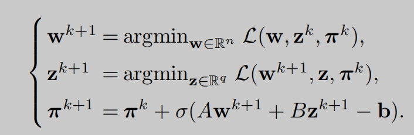

# 5 交替方向乘子法笔记

通过非精确ADMM进行联邦学习

# 摘要

==联邦学习的关键问题之一是如何开发有效的优化算法。===目前的大多数方法都需要完整的设备参与和/或强加强大的收敛假设。与广泛使用的基于梯度分散的算法不同，本文提出了一种不精确的交替方向乘子法（ADMM），该方法计算效率高，通信效率高，能够对抗偏离者的效应，并且在温和的条件下收敛。此外，与几种最先进的联邦学习算法相比，它具有较高的数值性能。==

# 1介绍

F扩展学习（FL），起源于[1]，[2]，，由于其能够解决各种应用程序，如车辆通信[3]，[4]，[5]，[6]，数字健康[7]，移动边缘和空中计算[8]，[9]，[10]，[11].它仍面临着许多挑战==。其中之一是如何为不同的目的开发高效的优化算法，如节省通信资源，加速学习过程，应对掉队者的效应，==等等。我们参考一些不错的调查[12]，[13]，[14]为更多的挑战。

在将FL应用到实际应用中之前，需要解决许多关键问题。在本文中，我们提出了一些激励我们研究的方法。

## ==1.1评价指标==

1.1.1通信效率

在客户端和中央服务器之间交换参数时，必须考虑到通信效率，因为频繁的通信会消耗昂贵的资源（如传输功率、能源和带宽）。提高通信效率的常用技术包括数据压缩和减少通信轮数（CR）。前者旨在在传输前对局部参数进行量化和稀疏化，以减少传输内容[15]、[16]、[17]、[18]的数量。对于后者，客户端和服务器之间的通信会定期进行，以减少CR [19]、[20]、[21]、[22]、[23]。在本文中，我们将利用这一策略。

1.1.2计算效率

由于越来越多的客户参与培训，为他们配备强大的计算能力显然是不现实的。因此，一个理想的FL算法能够降低计算复杂度，以减轻客户的计算负担。要实现这一点目标是，有两个很有希望的解决方案

第一个是一些关键项目的随机近似（如全梯度）的随机近似。这一想法在随机梯度下降（SGD）算法中被广泛应用，如联邦平均（FedAvg [19]）、局部SGD [22]，[23]和[24]，[25]，[26]。

==第二种解通过不精确求解子问题降低了计算复杂度，在非精确ADMM中得到了广泛的应用。它们允许客户端通过近似解决子问题来更新参数，从而异常加快计算速度[27]，[28]，[29]，[30]。我们将在我们的算法设计中利用这种技术==

1.1.3部分设备参与

由于中央服务器无法控制本地设备及其通信环境，由于传输资源不足或计算容量有限，一些客户端可能会延迟/撤回共享参数。这种现象被称为掉队者效应，即每个人都等待最慢的人。缓解这种效果的一种补救措施是让中央服务器接收到部分条件良好的客户来参加培训，这被称为部分设备参与[19]，[20]，[31]

基于此方案，FL算法可以分为以下两类。a)完整的设备参与活动。在开发基于全设备参与的算法方面，有大量令人印象深刻的工作，如非随机梯度下降方法[32]，[33]，[34]，[35]，SGD [21]，[22]，[23]，[26]，精确ADMM [36]，[37]，[38]，[39]，[40]，和不精确ADMM [27]，[28]，[29]，[30].然而，由于设备的完全参与，这些算法面临着掉队效应的风险，特别是在大量设备分布在边缘节点的情况下。它的价值原始优化问题和后两个也研究了对偶问题。

## 1.2本文的主要贡献

是开发了一种不精确的基于ADMM的FL算法（FedADMM，见算法1），具有以下优点。

a)通信和计算效率。该框架指出，全局平均只发生在某些步骤上（例如，在步骤k是预定义整数k0的倍数）。这意味着设置一个适当的k0可能会影响CR。结果表明，k0越大，我们的算法收敛的CR就越少，见图2。除了通信效率外，FedADMM还允许选定的客户端以灵活的精度近似地解决他们的子问题。在这方面，客户可以放松精度，以降低计算复杂度。

b)消除离散者的影响。在FedADMM中，在每一轮通信中，服务器将所有客户端分成两组。其中一组采用不精确的ADMM来更新其参数，而第二组的参数保持不变，即服务器可以将掉队者放入第二组，以减少其对训练的影响。c)mil下的收敛

c)在温和条件下的收敛。需要注意的是，第1.1节中提到的大多数算法都对模型施加了相对较强的假设来建立收敛性。常见的假设包括梯度Lipschitz连续性（也称为l平滑性）、凸性或强凸性。然而，我们已经证明了FedADMM收敛于具有次线性收敛速率：梯度Lipschitz连续性和目标函数的强制性，见定理4.2和4.3。

d)高数值性能。与几种先进算法的数值比较表明，FedADMM可以使用最少的CR和最短的计算时间来学习参数

## 1.3组织机构

本文件的组织方式如下。在下一节中，我们将提供一些数学方面的初步知识。在第3节中，我们提出了FedADMM算法，然后强调了它的优点。我们在第4节中建立了其全局收敛速度和收敛速度。最后两部分给出了数值比较和结论说明。

# 2.准备工作

在本节中，我们将介绍本文中要使用的符号，并介绍ADMM和FL。

## 2.1符号说明

我们使用纯字母、粗体字母和大写字母分别表示标量、向量和矩阵，例如，k和σ是标量，w和π是向量，w和Π是矩阵。设t是小于t + 1的最大整数（例如，1.1=2=2）。表示[m] ：= {1,2，·：=”，表示定义和

Rn具有内积的n维欧几里得空间·，·由w，z：=Piwizi定义。2-规范被写为∥·∥，即∥w∥2=w，w。函数f是梯度利普希茨连续，常数r > 0

对于任意两个向量w和z，其中∇f(w)是f相对于w的梯度。此后，对于Rn中的两组载体wi和πi，我们表示W ：=（w1、w2、···、wm）、Π ：=（π1，π2，···、πm）。类似的规则也适用于Wk、W∗、W∞和Πk、Π∗、Π∞。这里的k，∗和∞表示迭代次数、最优性和积累，例如，见推论4.1。

## 2.2 ADMM

我们参考最早的工作[52]和一本不错的书[42]来了解更多的ADMM细节，并简要介绍如下：给定一个优化问题，最小w∈Rn，z∈Rqf(w)+g(z)，s.t。Aw + Bz−b = 0，∈Rp×n，B∈Rp×q，b∈R p，其相应的增强拉格朗日函数L（w，z，π）：=f(w)+g(z)++Bz−b，π+σ2∥Aw + Bz−b∥2，π拉格朗日乘数和σ是一个给定的正常数。然后从一个初始点（w0、z0、π0）开始，ADMM迭代地执行以下步骤

其中π是拉格朗日乘子，σ是一个给定的正常数。然后从一个初始点（w0、z0、π0）开始，ADMM迭代地执行以下步骤

## 2.3 联邦学习

假设我们有m个本地客户端（或设备），其数据集为{D1、D2、···、Dm}。每个客户都有损失

其中ℓi（·；x）：Rn7→R是一个连续损失函数，从下面有界，di是Di的基数，w∈Rn是需要学习的参数。总体损失函数可以由

其中，αi是一个满足P m i=1 αi = 1的正权重。FL的任务是学习一个最优参数w∗，使总体损失最小化，即

